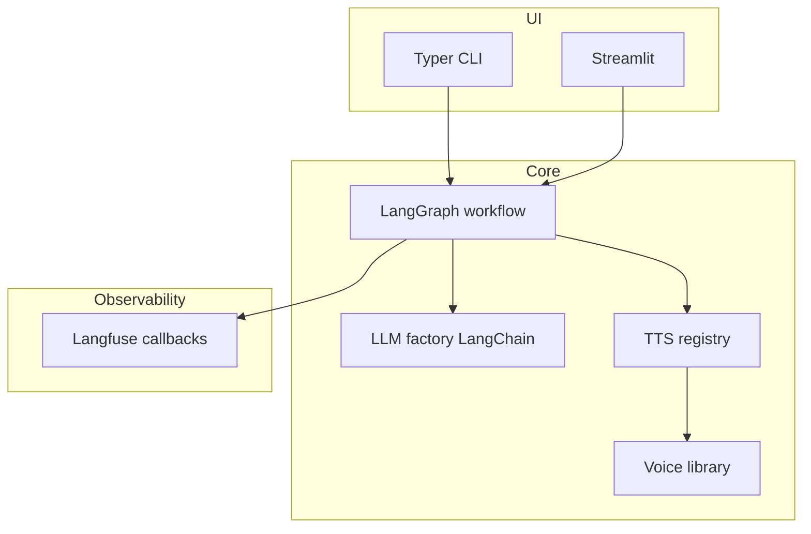

# Architecture

- **CLI / Streamlit** call `create_podcast()` in `app/graph/workflow.py`. You must pass **`episode_profile`** (name in `configs/episodes.json`) or a ready-made **`episode`** `EpisodeProfile`; there is no standalone “legacy speakers file” path.
- **LangGraph** runs nodes: outline → transcript → audio → combine.
- **LLM factory** (`app/llm/factory.py`) instantiates provider-specific `BaseChatModel` instances — see [llm-providers.md](llm-providers.md) (OpenAI, Anthropic, Mistral, Ollama, **OpenRouter**).
- **TTS registry** resolves `tts_provider` strings to concrete providers.
- **Voice library** (`configs/voices.json`): registered voices with target TTS provider and optional sample path; legacy `voices/metadata.json` is merged on read.
- **Speakers library** (`configs/speakers_library.json`): global speaker personas with optional `voice_ref` into the voice library, or inline `tts_provider` / presets.
- **Episode profiles** (`configs/episodes.json`): each profile lists **`speakers`** as 1–4 library ids (required to run). Resolution to runtime `SpeakerProfile` is in `app/services/speaker_resolver.py`.
- **Config loading** (`app/config_loader.py`): inline test overrides → files under **`configs/`** → optional **`app/resources/episodes.json`** (if present) → embedded skeleton (default profile name **`diverse_panel`** with empty `speakers` until you configure). **`configs/`** is gitignored in this repo so secrets and local JSON stay off git.
- **Langfuse** (optional): set `LANGFUSE_PUBLIC_KEY` (and secret) to trace `graph.ainvoke`; default `LANGFUSE_HOST` targets a local instance — see [observability.md](observability.md).
