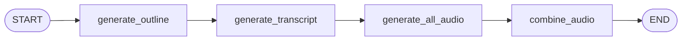
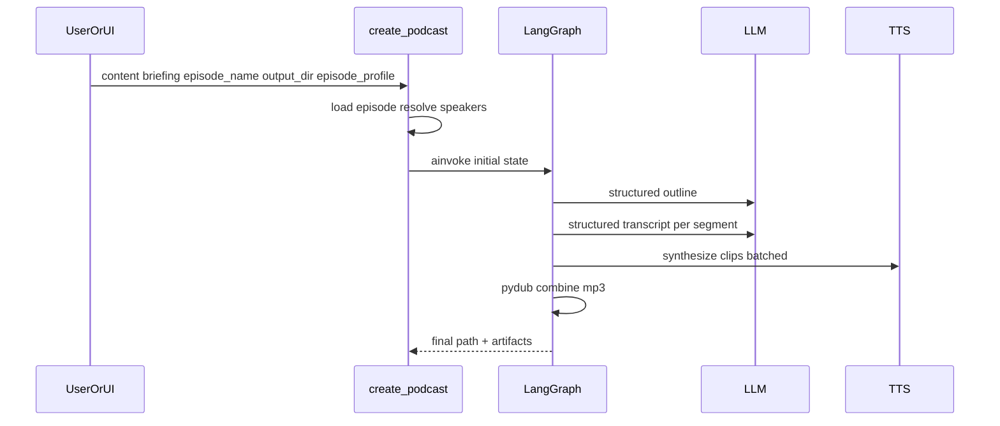

# Workflow

## Graph

## Sequence (high level)

## Artifacts

Given the **`output_dir`** you pass to `create_podcast` (e.g. `output/my_episode`), the pipeline writes:

- `{output_dir}/outline.json`
- `{output_dir}/transcript.json`
- `{output_dir}/clips/*.mp3` (per line / clip)
- `{output_dir}/audio/{episode_name}.mp3` (final mix)
